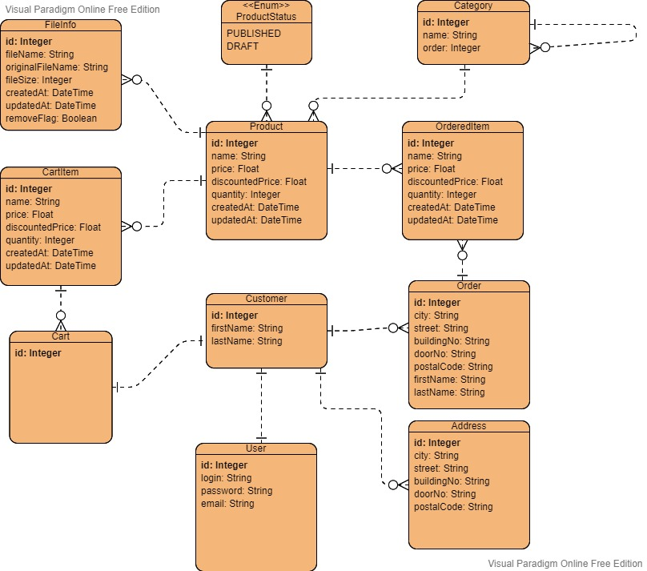

# SmartBuy

Prototyp sklepu internetowego podzielony na:

- Część Frontendową napisaną w języku TypeScript z użyciem frameworka Angular
- Część Backendową napisaną w języku Java z użyciem frameworka Spring

Bazowa aplikacja została wygenerowana z użyciem JHipster 7.6.0

## Baza danych

Budując aplikacje i uruchamiająć aplikacje z profilem dev
aplikacja będzie używała systemu do zarządzania H2 i będzie zapisywana na dysku w folderze target który jest domyślnym katalogiem przechowującym zbudowaną aplikację

### Opis tabel

####Diagram ERD


####Wyjaśnienia

- Category: posiada relację jeden do wielu do samej siebie aby móc utworzyć drzewo kategorii i ich podkategorii

- CartItem: posiada relację do produktu aby było wiadomo do jakiego produktu się odwołuje, pole quantity opisujące ilość egzemplarzy w koszyku danego produktu oraz pole price i discountPrice które przechowują cene w momencie dodania do koszyka

- OrderItem: posiada relację do produktu aby było wiadomo do jakiego produktu się odwołuje, pole quantity opisujące ilość egzemplarzy w danego produktu w danym zamówieniu oraz pole price i discount price które przechowują cene w momencie kupna

- FileInfo: tabela przechowuje informacje na temat zuploadowanego pliku(np. zdjęcia) do produktu przez administratora

- Cart: tabela jeden do jeden łączaca customera z produktami w koszyku

- Address: przechowuje adresy dodane przez klienta

- Order: przechowuje dane na temat danego zamówienia w tym adresowe i osobowe

- Product: posiada status służący temu czy produkt będzie widoczny na stronie (Published) czy nie (Draft)

## Budowanie i uruchamianie aplikacji

### Frontend

Aby uruchomić frontend należy najpierw zainstalować NodeJs:

https://nodejs.org/en/

Aplikacja była uruchamiana na nodejs 16.14.0 LTS

Nastepnie w terminalu wejść do folderu z projektem i zainstalować narędzia developerskie wpisująć polecenie

```
npm install
```

Kolejnym krokiem jest uruchomienie aplikacji frontendowej

```
npm start
```
